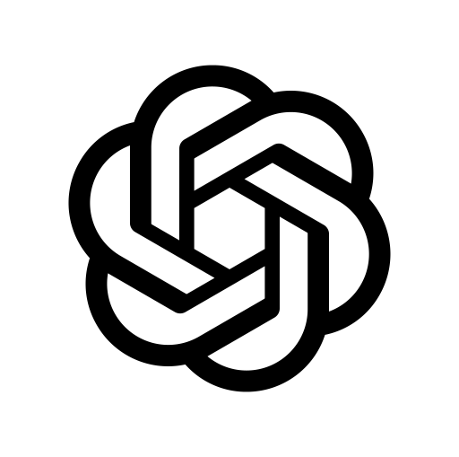

# 👋 Hi there, i'm Quang Le!

  

## 🌟 About Me

- I'm a experienced Frontend Engineer (since 2015) from Viet Nam. My strengths are UI/ UX, building scalable web apps + reusable components/ NPM packages and monitoring, optimizing web performance.

- Playing with Gen AI is one of my hobbies now.

---

## 🔗 Connect With Me

## 🚀 Tech Stack

### Frontend

  
|  |  |  |  |  |  |  |  |
|:---:|:---:|:---:|:---:|:---:|:---:|:---:|:---:|
| **Next.js** | **React** | **Redux** | **Angular** | **Vue** | **Storybook** | **Webpack** | **Module Federation (Micro FE)** |

### Styling & Design

  
|  |  |  |  |  |  |
|:---:|:---:|:---:|:---:|:---:|:---:|
| **Ant Design** | **Material UI** | **Tailwind CSS** | **SASS** | **LESS** | **Bootstrap** |

### Backend

  
|  |  |  |  |
|:---:|:---:|:---:|:---:|
| **Node.js** | **Express.js** | **Nest.js** | **GraphQL** |

### Tools & Additional Technologies

  
|  |  |  |  |  |  |  |  |  |
|:---:|:---:|:---:|:---:|:---:|:---:|:---:|:---:|:---:|
| **Typescript** | **Git** | **Cursor IDE** | **ChatGPT** | **Claude Code (Anthropic)** | **Socket.io** | **Auth0** | **Prisma** | **Datadog** |

### Cloud & DB

  
|  |  |  |  |  |
|:---:|:---:|:---:|:---:|:---:|
| **AWS** | **Azure** | **Google Cloud** | **Gitlab CI/CD** | **Github Action** |

### DB

  
|  |  |  |
|:---:|:---:|:---:|
| **MySQL** | **MongoDB** | **PostgreSQL** |

### Design & Communication

  
|  |  |  |  |  |  |  |
|:---:|:---:|:---:|:---:|:---:|:---:|:---:|
| **Figma** | **Slack** | **Jira** | **Photoshop** | **Photoshop** | **After Effect** | **Premiere** |

---

## 📊 GitHub Stats

  
  

---

## 🎯 Featured Projects

Visit my **<a href="https://quang.work" target="_blank">Portfolio</a>** to see my latest projects and work samples!

---

  
### 🙏 Thank you for visiting my profile!
  
⭐ **Star some repositories if you found them interesting!**
  

